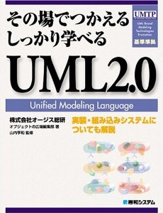

## ちょっとしたメモ

- [Markdown チートシート](./markdown-cheatsheet.html)
- [日本の暦](./material/japanese-calendar.html)

---
## 仕事関連 (ソフトウェア開発)

- オブジェクトの広場  
  <https://www.ogis-ri.co.jp/otc/hiroba/>
    - (プログラマのための) いまさら聞けない標準規格の話  
      <https://www.ogis-ri.co.jp/otc/hiroba/technical/program_standards/>
        - [第1回 文字コード概要編](https://www.ogis-ri.co.jp/otc/hiroba/technical/program_standards/part1.html) (2021-07-14)
        - [第2回 文字コード実践編](https://www.ogis-ri.co.jp/otc/hiroba/technical/program_standards/part2.html) (2021-08-19)
        - [第3回 ローマ字編](https://www.ogis-ri.co.jp/otc/hiroba/technical/program_standards/part3.html) (2022-02-21)
- GitHub  
  <https://github.com/glad2121>
    - 文字コード関連の情報  
      <https://github.com/glad2121/charsets>
    - ユーティリティ (文字コード・文字列・数値・日時等)  
      <https://github.com/glad2121/glad-utils>

---
## 著作・翻訳

- プログラミング Scala (共訳、オライリー)  
  <https://www.oreilly.co.jp/books/9784873114811/>  
  <https://www.amazon.co.jp/dp/4873114810>
- その場でつかえるしっかり学べる UML2.0 (共著、秀和システム、絶版)  
  <https://www.shuwasystem.co.jp/book/4798012394.html>  
  <https://www.amazon.co.jp/dp/4798012394>

---
## コミュニティ

- CloudNative Days (2019-)  
  <https://cloudnativedays.jp/>
- 日本 Java ユーザーグループ (2007-)  
  <https://www.java-users.jp/>
- redmine.tokyo (2011-)  
  <https://redmine.tokyo/>
- Java EE 勉強会 (2004-)  
  <https://www.wikihouse.com/withoutEJB/>
- PofEAA 読書会 (2004-2006)  
  <https://bliki-ja.github.io/pofeaa/>
- Seasar プロジェクト (2004-2016)  
  <https://www.seasar.org/>

---
## 音楽関連

あとで。

---
## 鉄道・旅行関連

あとで。

---
## SNS

- Twitter
    - <https://twitter.com/glad2121> (本垢)
    - <https://twitter.com/glad_lgm> (音楽関連)
    - <https://twitter.com/glad_ssw> (SSW 関連)
- Twilog
    - <https://twilog.org/glad2121> (本垢)
    - <https://twilog.org/glad_lgm> (音楽関連)
    - <https://twilog.org/glad_ssw> (SSW 関連)
- はてなブログ
    - <https://aufheben.hatenadiary.com/> (仕事関連)
    - <https://glad2121.hatenablog.com/> (音楽関連)
- はてなブックマーク
    - <https://b.hatena.ne.jp/aufheben/>
- Instagram
- Facebook
- mixi
- YouTube
    - <https://www.youtube.com/channel/UChq8VCkyI1EGhyWJhZPHtnw>
    - <https://www.youtube.com/channel/UCGaLc21MNtdowk3k2rxISHQ>

---
## ちょっと古いもの

- オブジェクトの広場
    - ラッピングに関する一考察 (2003-02-20)  
      <https://www.ogis-ri.co.jp/otc/hiroba/technical/wrapping/>
    - C++ クラス設計に関するノート (2002-10-24)  
      <https://www.ogis-ri.co.jp/otc/hiroba/technical/CppDesignNote/>
    - UML による XML 設計ガイド (2002-01-24)  
      <https://www.ogis-ri.co.jp/otc/hiroba/technical/UML2XML/>
    - CppUnit 入門 (2001-09-20)  
      <https://www.ogis-ri.co.jp/otc/hiroba/technical/CppUnit/>
    - OOエンジニアの輪！  
      <https://www.ogis-ri.co.jp/otc/hiroba/others/OORing/>
- SlideShare
    - インターネット非接続環境で、Redmine & Subversion のインストール＆設定を、Ansible を使って自動化してみた (2015-05-16)  
      <https://www.slideshare.net/glad2121/redmine-ansible-48223729>
- CppUnit-x  
  <https://ja.osdn.net/projects/cppunit-x/>

---
## 教育関連

あとで。
